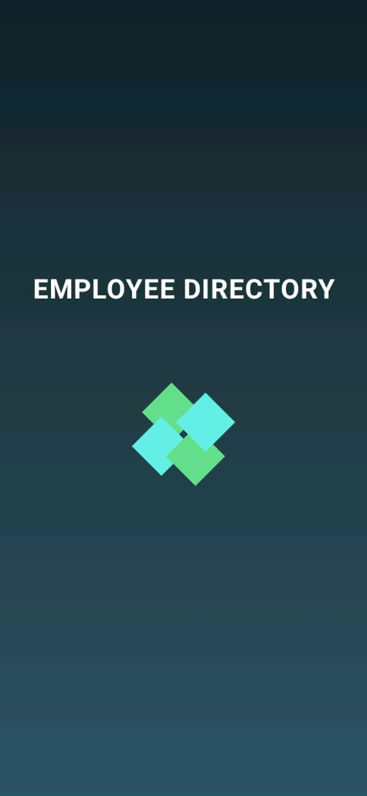
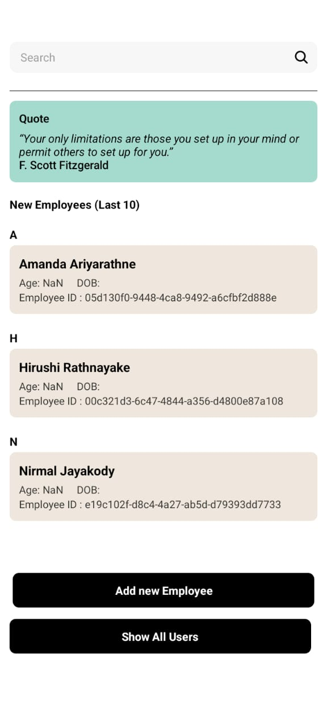
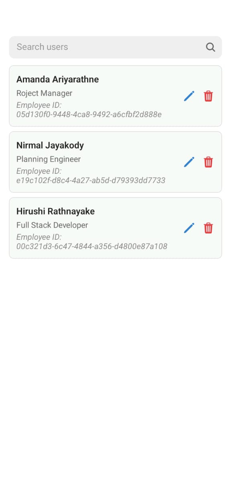
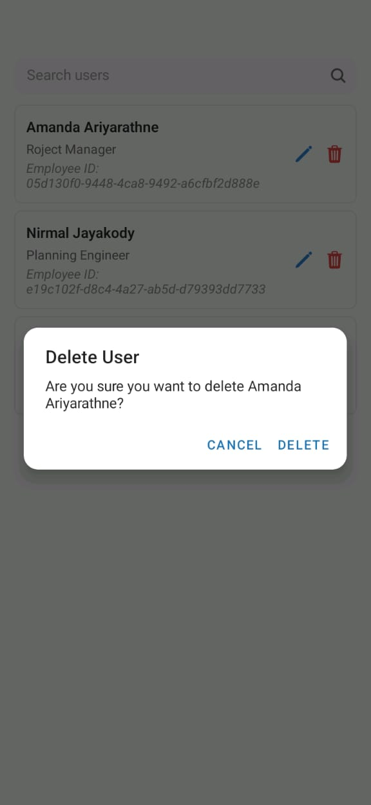

# React Native Job App



---

## Assessment Overview

This project is a React Native mobile application developed as part of a **3-day React Native Assignment**. The assignment evaluates proficiency in React Native development, REST API integration, and core architectural principles.

The app follows modern React Native practices and uses Git for version control, with meaningful commits after each feature implementation.

---

## Project Scenario

You are provided with a prototype for reference. In addition to the prototype, the app implements missing user interfaces and completes all UI components according to design fidelity, including:

- Add New User
- Delete User
- Preview User Details

---

## Screens and Features

- **Splash Screen**  
  Displays an initial branded loading screen with animated effects.

- **Login Screen**  
  Basic authentication with a mocked PIN, including validation of inputs.

- **Main Screen**  
  Shows a random quote fetched from the REST API `https://api.realinspire.live/v1/quotes/random`.  
  Displays the latest 10 employees added to the app with a search functionality.

- **User Management**  
  - Add new users  
  - Edit existing user details  
  - Delete users  
  - Preview user details via a modal interface  

---

## Technical Implementation

- **Architecture**  
  Modular Clean Architecture principles with separation of concerns and reusable components.  
  Utilizes React Hooks, Context API, and Redux Toolkit for state management.

- **Design Principles**  
  Applied Object-Oriented Programming (OOP) and SOLID principles for maintainability and extensibility.

- **Navigation**  
  React Navigation for smooth screen transitions.

- **Input Validation**  
  Validates user input on forms such as login and add/edit user screens.

- **Offline Caching**  
  Uses Redux Toolkit with persistence to cache user data offline.

- **REST API Integration**  
  Fetches a random quote from the public API endpoint with error handling.

- **Design Fidelity**  
  Matches the prototype design closely with consistent colors, fonts, and spacing.  
  Uses placeholder colors and styles where the prototype lacks specifics.

- **Performance Optimization**  
  Optimized for both Android and iOS platforms using best practices such as memoization, lazy loading, and efficient FlatList rendering.

---

## Screenshots

### Splash Screen  


### Login Screen  


### Main Screen  


### User List  


### Edit User  


### Delete User Confirmation  


---

## Setup Instructions

1. **Clone the repository**

```bash
git clone https://github.com/hirushiRathnayake/React-Native-Job-App.git
cd React-Native-Job-App
```

2. **Install dependencies**

```bash
npm install
# or
yarn install
```

3. **Run the app**

Using Expo CLI:

```bash
expo start
```

Scan the QR code with Expo Go on your device or launch the Android/iOS simulator.

---

## API Endpoint

* Random Quote API:
  `https://api.realinspire.live/v1/quotes/random`

The app fetches a random quote on the main screen and displays it with fallback handling.

---

## Git Version Control

* The project uses **Git** with meaningful commits after implementing each feature or screen.
* The full commit history is available on the public GitHub repository linked below.

---

## Repository Link

[React Native Job App Repository](https://github.com/hirushiRathnayake/React-Native-Job-App)

---

## Contact

For questions or feedback, please contact:
**Hirushi Rathnayake**
Email: [hirushir99@gmail.com](mailto:hirushir99@gmail.com)

---

## Notes

* This app demonstrates modern React Native development techniques and clean architecture.
* UI components are reusable and styled for consistency.
* Input validation and error handling ensure a smooth user experience.
* The app is optimized for performance on both iOS and Android platforms.

---

Thank you for reviewing my submission.
